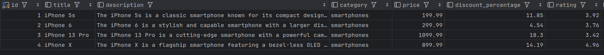

# Загрузка продуктов сайта <a href="https://dummyjson.com/docs/products">dummyjson.com</a>

### Инициализация

- Склонировать проект
- Выполнить команду: composer install
- Создать .env файл: cp .env.example .env
- Внести данные для подключения к БД в файлах phinx.json и .env

## Загрузка данных

Загрузка данных доступна по средствам вызова консольной команды load-product с необязательными параметрами
category и title

Пример вызова команды: 
```
php bin/console load-product smartphones iPhone
```
Пример результата выполнения:


